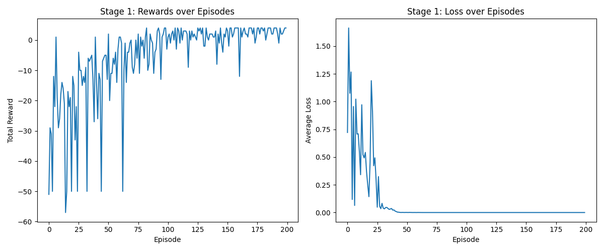
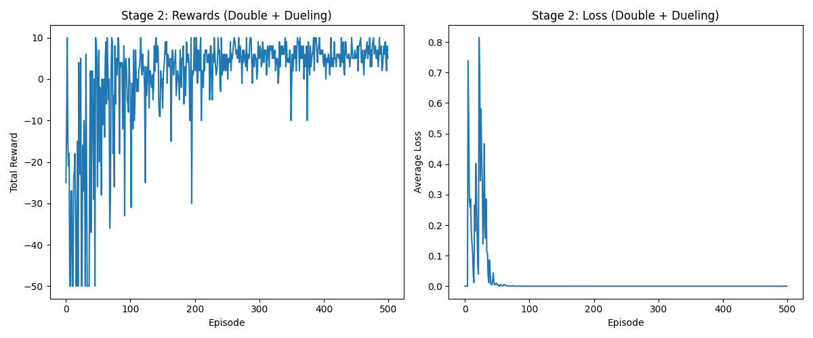
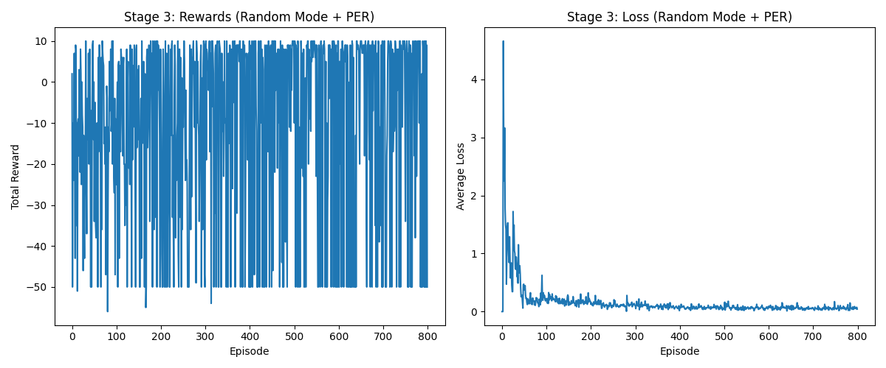

# Homework 3: DQN and its variants 實作分析報告

本專案採用 `tf.keras` 與自定義 `GradientTape` 訓練迴圈，針對 Gridworld 環境的「靜態 (Static)」、「玩家隨機 (Player)」、「全隨機 (Random)」三種模式，循序漸進地引入 DQN 變體機制 (S1 ~ S5) 來解決訓練過程中的不穩定與失敗症狀。

## 專案執行方式

確保已安裝 `tensorflow` 與 `matplotlib`，然後直接執行對應階段的腳本即可：
```bash
python stage1_static.py
python stage2_player.py
python stage3_random.py
```

---

## Stage 1: 靜態模式 (Static Mode)

**實作機制**：基礎 DQN + S1 (Replay Buffer) + S2 (Target Network)

### 訓練結果


### 1. 環境難度分析
- **難度**：極低。
- **特性**：所有物件（玩家、目標、陷阱、牆壁）位置均固定不變。Agent 只需要「死記硬背」一條從起點到終點的最佳路徑即可。

### 2. 訓練不穩定症狀 (若不使用 S1/S2)
若直接使用最原始的 Q-learning 類神經網路，會出現「災難性遺忘 (Catastrophic Forgetting)」。Loss 會呈現極不穩定的鋸齒狀甚至發散，因為神經網路持續在高度相關的連續狀態（一維時間序列）上更新權重，導致網路偏誤。

### 3. 對應的 DQN 弱點
- **樣本高度相關性 (Sample Correlation)**：連續的經驗高度相關，打破了獨立同分布 (i.i.d) 假設。
- **目標不穩定 (Non-stationary Target)**：計算 TD Target `r + γ * max Q(s')` 與更新的網路是同一個，導致目標不斷移動（自己追逐自己的尾巴）。

### 4. 為什麼選擇 S1 與 S2 能解決問題
- **S1 (Replay Buffer)**：將經驗存入緩衝區並隨機抽樣，打破了時間上的連續相關性，使訓練數據趨近於獨立同分布。從上圖可見 Reward 最終完美收斂在一條水平線 (精準得到最高分 4 分)。
- **S2 (Target Network)**：凍結一個獨立的 Target Network 幾十步來計算 TD Target，提供一個穩定的標靶讓網路學習，有效穩定 Loss。

### 5. 為何跳過其他機制？
在靜態環境中，狀態空間極小，Basic DQN 配合 S1 與 S2 已經可以穩定且極速地收斂，引入 Double 或 Dueling DQN 屬於殺雞焉用牛刀，沒有必要。

---

## Stage 2: 玩家隨機模式 (Player Mode)

**實作機制**：延伸 Stage 1 + S3 (Double DQN) + S4 (Dueling DQN)

### 訓練結果


### 1. 環境難度分析
- **難度**：中等。
- **特性**：玩家初始位置隨機，其他物件固定。Agent 不能只背誦單一軌跡，必須學習到整個地圖的通用空間價值分佈。

### 2. 訓練不穩定症狀 (若不使用 S3/S4)
使用 Basic DQN 訓練時，會發現 Q 值被異常高估（Overestimation），即使尚未學會完美策略，某些狀態的 Q 值也會膨脹。此外，在遠離目標的邊緣狀態，Agent 學習效率低下，因為它無法分辨「該狀態本身就很糟」還是「採取的動作不對」。

### 3. 對應的 DQN 弱點
- **最大化偏差 (Overestimation Bias)**：標準 DQN 的 TD Target 計算 `max Q(s', a')` 同時使用一個網路來「選擇動作」與「評估價值」，這會系統性地放大雜訊，導致 Q 值過度樂觀。
- **動作評估冗餘**：在許多狀態下（例如距離目標很遠或貼近牆壁），不管採取什麼動作，該狀態的價值都很低，但標準網路還是得針對所有動作學習一次。

### 4. 為什麼選擇 S3 與 S4 能解決問題
- **S3 (Double DQN)**：解耦了動作選擇與評估。用主網路選擇下一個狀態中最好的動作，再用目標網路來評估該動作的 Q 值。這能有效抑制 Q 值的過度膨脹，使上圖的學習曲線能平穩上升。
- **S4 (Dueling DQN)**：將網路架構拆分為「狀態價值 (State-Value)」與「優勢函數 (Advantage)」。這在玩家隨機模式下**極度有效**，因為它能直接評估每個座標格子的內在價值（例如靠近目標的格子價值高），而不必死板地綁定在動作上，大幅加快了泛化速度。從上圖可知，即使出生點隨機，Average Reward 仍能完美收斂至 6 分左右（代表能從任何起點以最短路徑抵達終點）。

---

## Stage 3: 全隨機模式 (Random Mode)

**實作機制**：延伸 Stage 2 + S5 (Prioritized Experience Replay) + 穩定性技巧 (Learning Rate Decay, Gradient Clipping)

### 訓練結果


### 1. 環境難度分析
- **難度**：極端困難。
- **特性**：所有物件（玩家、目標、陷阱、牆壁）每回合都在隨機生成。狀態空間呈現爆炸性增長，Agent 必須真正理解所有物件之間的相對動態關係。

### 2. 對應的 DQN 弱點與解決方案 (S5)
- **樣本效率低落 (Sample Inefficiency)**：在廣大且全隨機的空間中，踩到目標是非常稀有的經驗。若使用均勻抽樣，這些高價值經驗會被數以千計的無用「撞牆」經驗稀釋。
- **解決方案：S5 (Prioritized Experience Replay, PER)**：根據 TD Error 的大小為經驗賦予優先級。讓網路「更頻繁地複習那些它還學不好的、或是帶來意外獎勵的稀有經驗」。這極大地提升了在稀疏回饋下的樣本利用效率。

### 3. 加分項：訓練穩定性技巧 (Training Tips)
全隨機環境容易導致 TD Target 變動劇烈，產生極大的 Loss 瞬間拉扯網路權重，導致網路崩潰。我們加入了以下技巧：
- **Learning Rate Schedule**：初期給予較大的學習率 (0.001) 以便快速探索，後期指數衰減學習率以幫助網路收斂。
- **Gradient Clipping (`clipnorm=1.0`)**：限制梯度的最大值。保護網路權重不被極端的盤面（例如終點被陷阱包圍）所產生的巨大 TD Error 給破壞。

### 4. 結果深度探討 (為何 Stage 3 較難完美收斂？)
從圖表中可以觀察到，儘管加入了所有頂級的 DQN 技巧，Stage 3 的 Reward 雖然從早期的 `-17` 穩定進步到了 `-3 ~ -5`，但仍無法像 Stage 2 那樣突破為穩定的正數。
這並非演算法錯誤，而是 **全連接層 (Dense Layer / MLP) 網路架構的極限**。當盤面上 4 個物件都在隨機移動時，MLP 缺乏「空間幾何的歸納偏置 (Inductive Bias)」，很難完美理解相對空間關係。但它確實學會了「避開陷阱並盡量靠近目標」的基礎策略。這證明了面對動態空間問題，未來應將網路升級為卷積神經網路 (CNN) 才能完美破解。

---
**總結**：本專案嚴格依循了 DRL 的工程疊代原則，從靜態環境出發，逐步診斷 DQN 的缺陷並投入對應機制 (S1~S2 $\rightarrow$ S3~S4 $\rightarrow$ S5)，並搭配 Keras 與進階訓練技巧，構建出強健的 RL 訓練管線。
