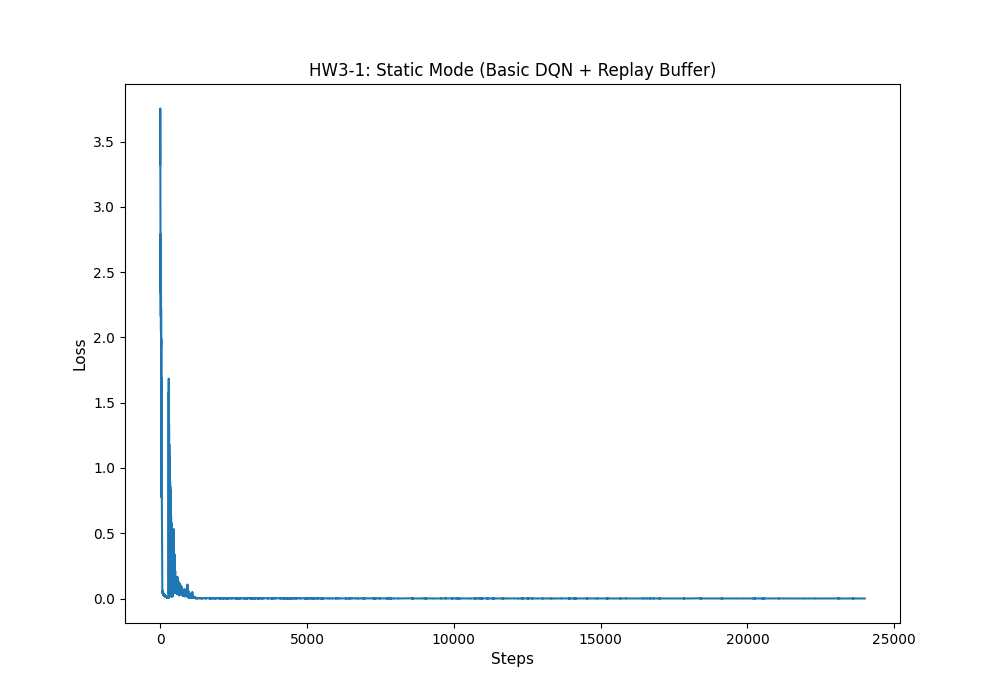
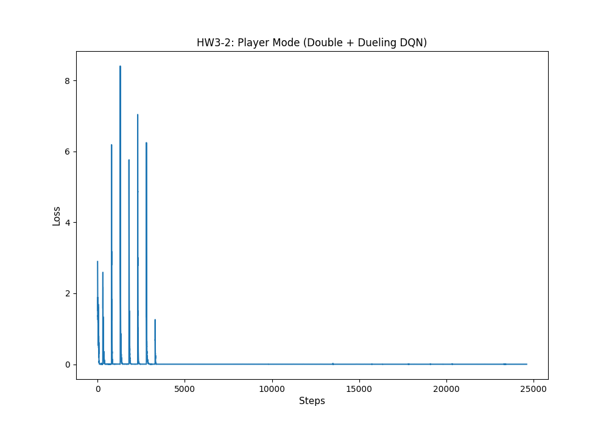
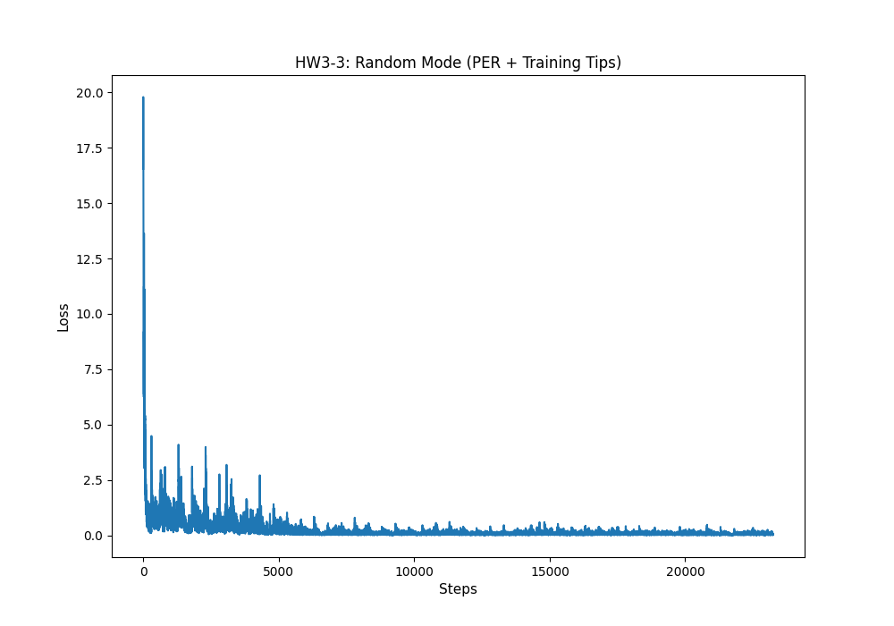

# DQN and its Variants 實作分析報告

本專案採用 `tf.keras` 與自定義 `GradientTape` 訓練迴圈，針對 Gridworld 環境的「靜態 (Static)」、「玩家隨機 (Player)」、「全隨機 (Random)」三種模式，循序漸進地引入 DQN 變體機制來解決訓練過程中的不穩定與失敗症狀。所有實作皆以教材提供之 `Gridworld` 環境與類神經網路架構 (`64 -> 150 -> 100 -> 4`) 為基礎進行改寫。

---

## 3-1: 靜態模式 (Static Mode)

**實作腳本**：`3_1_static.py`  
**實作機制**：基礎 DQN + S1 (Experience Replay Buffer)

### 訓練結果

### 分析與報告
- **環境難度分析**：極低。所有物件（玩家、目標、陷阱、牆壁）位置均固定不變。Agent 只需要找到並記住一條從起點到終點的固定路徑。
- **訓練不穩定症狀 (若不使用 Experience Replay)**：若只使用最原始的 Naive DQN，會發現 Loss 呈現極不穩定的震盪，發生「災難性遺忘 (Catastrophic Forgetting)」。這是因為連續收集到的樣本是高度時間相關的，違反了類神經網路訓練時需要的 i.i.d (獨立同分佈) 假設。
- **選擇的 DQN 機制 (S1: Replay Buffer)**：使用 `collections.deque` 建立經驗回放池 (Replay Buffer)。我們將每一步的經驗存入 buffer 中，然後隨機抽樣來進行訓練。這打破了樣本之間的時間相關性，平滑了資料分佈，讓神經網路可以穩定學習，有效降低 Loss 並收斂。

---

## 3-2: 玩家隨機模式 (Player Mode)

**實作腳本**：`3_2_player.py`  
**實作機制**：延伸 3-1 + S2 (Target Network) + S3 (Double DQN) + S4 (Dueling DQN)

### 訓練結果

### 分析與報告
- **環境難度分析**：中等。Player 的出生點隨機，其他物件固定。Agent 無法只依賴死記單一軌跡，必須學習到整個空間的「泛化策略」，知道在任何位置該往哪個方向走。
- **訓練不穩定症狀 (若不使用 Double/Dueling)**：在起點隨機的情況下，若只使用 Basic DQN，很容易發生「Q值高估 (Overestimation Bias)」，因為 max 運算會將雜訊放大。這會導致模型變得過度樂觀，無法收斂。同時，在離終點很遠的格子，或是撞牆的格子，由於價值極低，若使用單一流 (Single Stream) 的網路，學習效率會很差，因為網路需要為每個獨立的動作分別學會「在這個狀態很爛」。
- **選擇的 DQN 機制 (S3: Double DQN, S4: Dueling DQN)**：
  - **S3 Double DQN**：將「選擇動作」與「評估動作價值」的神經網路拆開（利用 Target Network 評估 Primary Network 選出來的動作）。這極大程度地抑制了 Q 值的爆炸與高估。
  - **S4 Dueling DQN**：將網路拆分為「State-Value (V)」與「Advantage (A)」。這對於 Player Mode 非常關鍵，因為模型可以直接評估「目前這個格子有多好 (V)」，而不必管接下來要走哪裡。這大幅加速了從不同隨機起點出發時的價值收斂。

---

## 3-3: 全隨機模式 (Random Mode)

**實作腳本**：`3_3_random.py`  
**實作機制**：延伸 3-2 + S5 (Prioritized Experience Replay) + 穩定性技巧 (Learning Rate Decay, Gradient Clipping, Wall Collision Penalty)

### 訓練結果

### 分析與報告
- **環境難度分析**：極端困難。Player、Goal、Pit、Wall 的位置在每一回合都會完全隨機生成。盤面的狀態空間呈現爆炸性增長，模型必須真正學會物件之間的「相對動態空間關係」，而不能只靠背座標。
- **訓練不穩定症狀 (若不使用 PER 與 Training Tips)**：在全隨機環境中，找到目標 (+10) 或是掉進陷阱 (-10) 的經驗變得相對稀少，大部分的經驗都是在無意義地移動 (-1)。若使用一般均勻抽樣的 Replay Buffer，模型會被大量無用經驗稀釋，學習極度緩慢甚至卡在區域最佳解。同時，由於每次盤面差異極大，TD Target 計算會產生巨大的梯度變異，導致 Loss 劇烈震盪，破壞原本學好的權重。
- **選擇的 DQN 機制 (S5: PER) 與 Training Tips**：
  - **S5 Prioritized Experience Replay (PER)**：為每次經驗計算 TD Error，誤差越大的經驗（代表模型越驚訝、沒學好的部分，如意外抵達終點）被抽樣重放的機率越高。這解決了稀有經驗被稀釋的問題，極大提升了樣本利用率。
  - **Learning Rate Schedule**：初期給予較大的學習率以便在龐大隨機空間中快速探索，後期指數衰減學習率，穩定網路收斂。
  - **Gradient Clipping**：由於隨機環境造成的 TD Error 變異極大，限制梯度的最大值能保護網路權重不崩潰。
  - **Wall Collision Penalty**：參考老師的進階技巧，給予撞牆 -5 的懲罰，強迫模型更快理解邊界規則，加速訓練速度。
