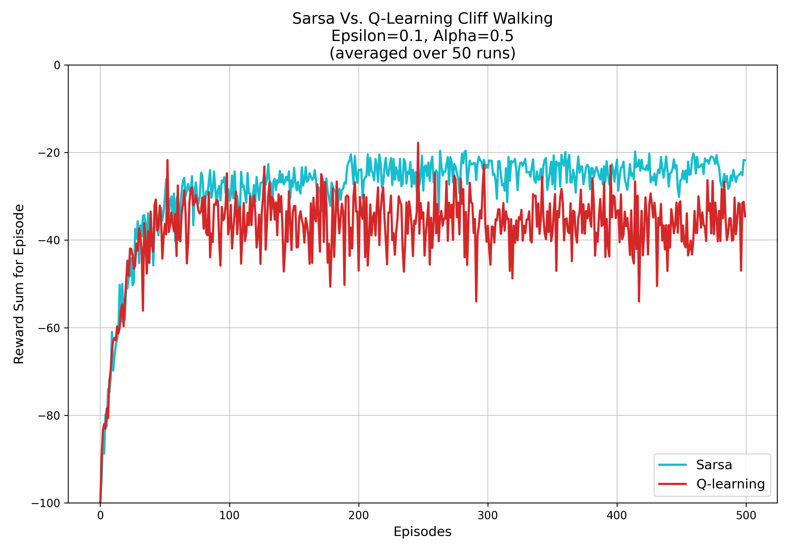
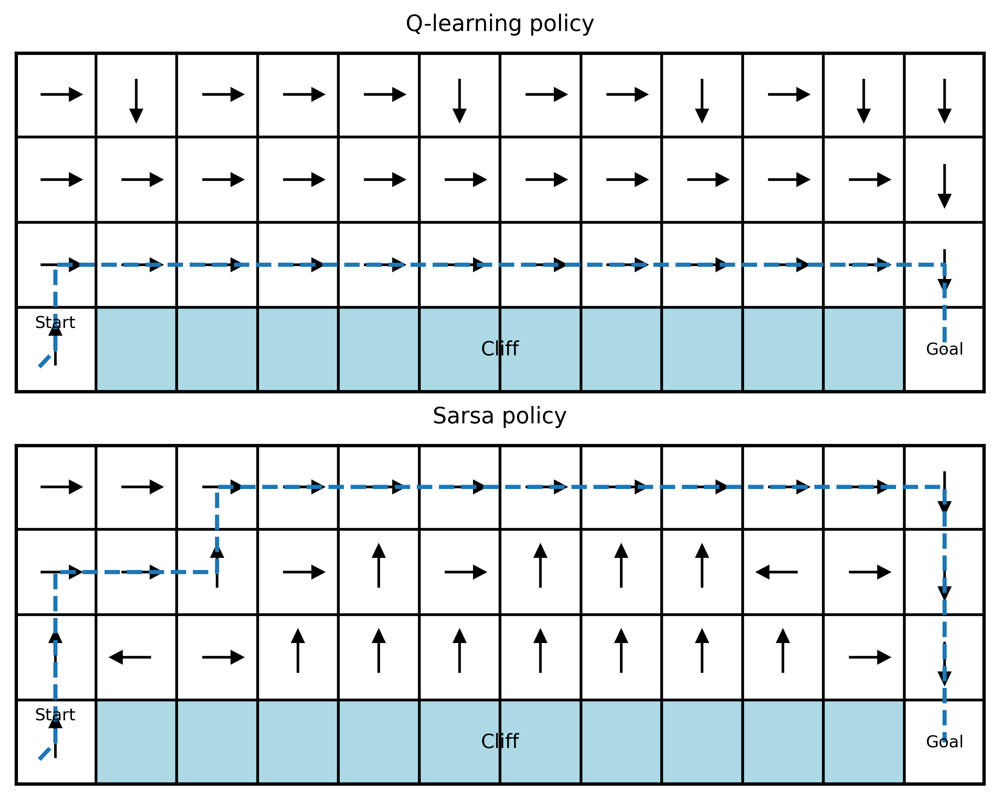

# Q-learning 與 SARSA 演算法之比較與分析報告

本專案實作並比較在 Cliff Walking（懸崖尋路）環境下的 Q-learning 與 SARSA 強化學習演算法。

## 🚀 快速執行
請確保已安裝 Python 以及必備套件 `numpy`, `matplotlib`：
```bash
python -m pip install numpy matplotlib
python main.py
```
執行後會產生學習曲線比較圖以及策略視覺化圖。

---

## 一、 實驗設定概述
本實驗在標準的 4 × 12 懸崖尋路（Cliff Walking）環境中，分別實作了 Q-learning 與 SARSA 兩種強化學習演算法。
參數設定如下：
- **策略**：ε-greedy (ε = 0.1)
- **學習率 (α)**：0.5
- **折扣因子 (γ)**：1.0
- **測試次數**：平均 50 次獨立運行
- **回合數 (Episodes)**：500 回合

---

## 二、 結果分析

### 1. 學習表現與收斂速度
- 兩種演算法在初期的獎勵都非常低（因為經常掉入懸崖），但隨著回合數增加，兩者都能夠逐漸收斂。
- **收斂速度**：兩者在 50 到 100 回合附近都開始顯著提升並趨於平穩。然而，SARSA 在平穩後的平均獎勵（約 -17）高於 Q-learning（平均約 -50），因為在 `ε-greedy` 策略下運行時，SARSA 會主動避開懸崖，從而減少了在探索過程中掉入懸崖的巨大懲罰 (-100)。



### 2. 策略行為分析
經過學習後取出兩者的貪婪策略（Greedy Path），結果如下：



**Q-Learning 最終路徑（冒險）**：
- **路徑長度/獎勵**：經過 13 步，貪婪獎勵為 -13。
- **行為傾向**：Q-learning 走的是**最邊緣、最短的一條路徑**（緊貼懸崖上方）。因為它學習的是理論上的最優解，並**傾向冒險**以追求最大化未來獎勵。

**SARSA 最終路徑（保守）**：
- **路徑長度/獎勵**：經過 17 步，貪婪獎勵為 -17。
- **行為傾向**：SARSA 選擇了**遠離懸崖的安全路徑**（靠上方邊緣走）。這是由於 SARSA 在評估狀態-動作價值時，會將探索期間（ε=0.1 時有 10% 機率隨機走）可能掉下懸崖的風險納入考量，因此它表現得**傾向保守**。

### 3. 穩定性分析
- **學習過程中的波動**：從訓練學習曲線可觀察到，Q-learning 在學習中後期的波動幅度仍較大。即使它內部已經學到了最優解，但在實際以 ε-greedy 執行時，這條「緊貼懸崖」的路徑有 10% 的機率會因為隨機探索而掉入懸崖，導致出現極低的獎勵。
- **探索的影響**：SARSA 因為是同策略（On-policy），更新時已經考量了 ε 的探索行為機制會帶來掉入懸崖的風險，因此退而求其次選擇安全的遠路，這使得 SARSA 即使在探索過程中也能保持較為穩定的單回合總獎勵。

---

## 三、 理論比較與討論

- **Q-learning 為離策略（Off-policy）**：在更新 Q 值時，它是基於「下一狀態所有可能動作中，Q 值最大者（即最佳解的動作）」來更新。也就是說，不管它實際上採取的探索動作是什麼，它在評估時永遠假設自己下一步會採取最優行動。因此，它會毫不畏懼地學出那條緊貼懸崖的最短路徑。
- **SARSA 為同策略（On-policy）**：在更新 Q 值時，它是基於「實際依據當時策略（ε-greedy）所採取的下一個行動」來更新。因為當前策略有隨機亂走的機率，走在懸崖邊緣極易因為這 10% 的隨機動作而跌落，因此 SARSA 實際感受到的價值包含這些巨大的懲罰，使其認為懸崖邊的狀態是不好的，最後收斂出一條安全的長遠路徑。

總結來說，Q-learning 忽略了自身現在使用的是不完美的 ε-greedy 策略，專注於找到終極完美的策略解；而 SARSA 則務實地評估了當下的 ε-greedy 策略，找出在該既定策略下最安逸的行動。

---

## 四、 結論要求

1. **哪一種方法收斂較快？**
   在找到「理論最佳策略」的意義上，Q-learning 會穩定逼近最優解；但在「實際體驗的獎勵收斂速度」上，**SARSA 較快達到平穩狀態**，因為 SARSA 會盡早學會遠離懸崖，避開嚴重的懲罰。

2. **哪一種方法較穩定？**
   在訓練過程中（即持續有探索 ε 加入的情況下），**SARSA 明顯較穩定**。因為 SARSA 所採取的保守路徑，容許代理在路徑中隨機亂走而不會受到毀滅性的懲罰。相反地，Q-learning 走在懸崖邊緣會頻繁地因探索而墜崖，導致單回合的波動劇烈。

3. **在何種情境下應選擇 Q-learning 或 SARSA？**
   - **應選擇 SARSA 的情況**：當探索過程中的錯誤會產生高昂（或無法承受）的真實代價時（例如：控制真實的無人機、訓練一台實體自駕車、高頻交易等）。在這些應用中，在線（On-line）訓練的安全性無比重要，我們希望代理在探索的同時保證安全。
   - **應選擇 Q-learning 的情況**：當環境處於完全的離線模擬狀態（Offline / Simulation），且訓練過程中失敗的成本很低，我們只關心最終獲得的策略是否是絕對最佳解（例如：下棋、電玩遊戲），則此時用 Q-learning 能確保取得最高上限的最優策略。
